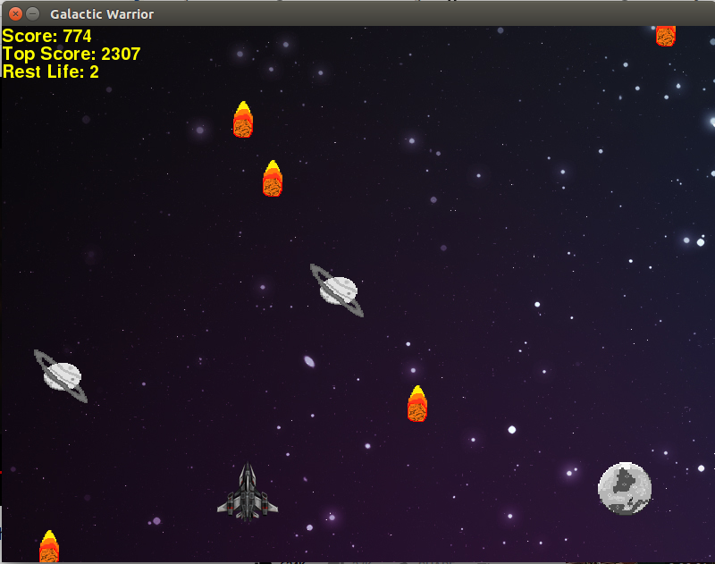

# Galactic Warrior

 A Python based 2D arcade game built using the pygame module. The Game is pretty simple, you can move in four directions and all you have to do is dodge the meteorites, satellites and planets.

## Requirements
* Pygame ( [Installation](https://www.pygame.org/wiki/GettingStarted) )
* A MP3 file for Soundtrack ( save it as 'soundtrack.mp3' in the directory where the python file is )

## Screenshot of the gameplay

# Features

* Three Stages of Difficulty, which increases as your score increases.
* An Amazing Soundtrack
* Abitlity to Add Soundtrack of your choice for the game.
* Keeps track of your all time High Score.

# Controls

Well, the controls are pretty easy . Use the four arrow keys for movement and dodge the objects. You have three lives to set a high score. 